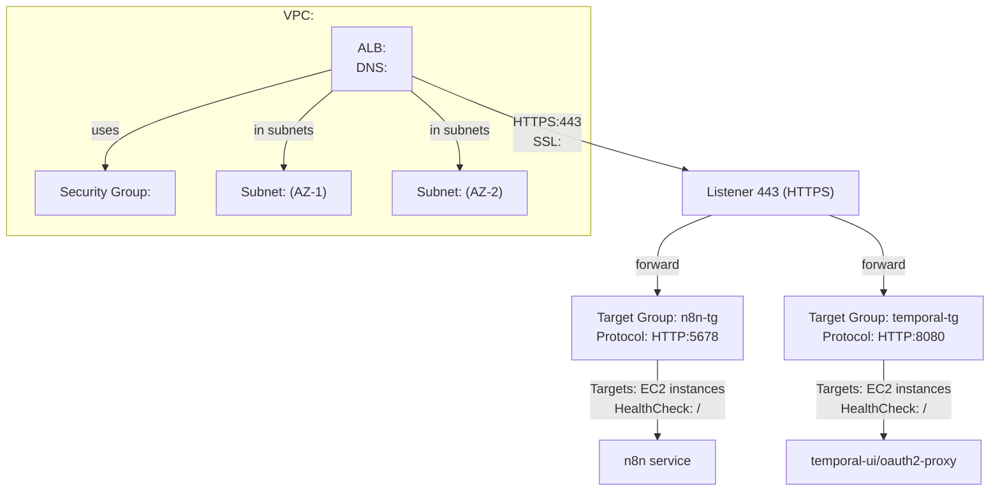

# AWS Application Load Balancer (ALB) Setup

This document describes the configuration and architecture of the AWS Application Load Balancer (ALB) used in the project.

---

## Architecture Diagram

---

## Key Configuration Points

- **ALB Listener:**
  - Port: 443 (HTTPS)
  - SSL certificate: `<acm-certificate>` (managed by AWS ACM)
- **Target Groups:**
  - `n8n-tg`: forwards to n8n service on HTTP port 5678
  - `temporal-tg`: forwards to temporal-ui/oauth2-proxy on HTTP port 8080
- **Health Checks:**
  - Path: `/`
  - Protocol: HTTP
- **Subnets:**
  - ALB is deployed in at least two subnets for high availability (AZ-1, AZ-2)
- **Security Group:**
  - Only allows necessary inbound/outbound traffic (typically HTTPS from the internet)

---

## Useful Links

- [AWS ALB Documentation](https://docs.aws.amazon.com/elasticloadbalancing/latest/application/introduction.html)
- [AWS ACM Documentation](https://docs.aws.amazon.com/acm/latest/userguide/acm-overview.html)
- [Mermaid Live Editor](https://mermaid.live/) (for diagram preview)
