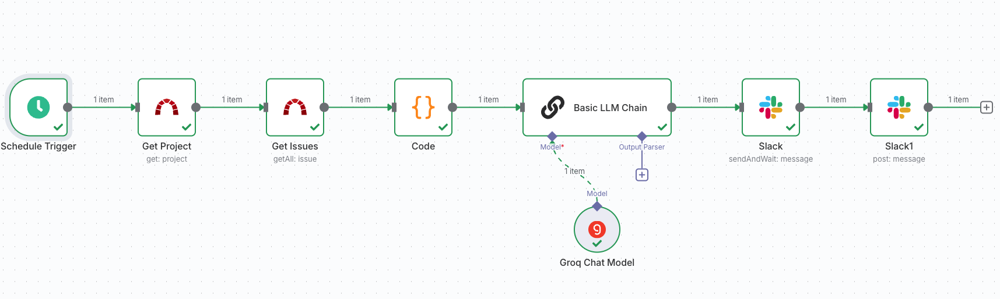
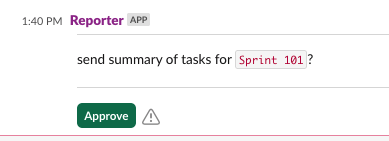

## Redmine Sprint Summary Workflow



**Description:**  
Automation of collecting and sending sprint task summaries from Redmine to Slack. The workflow fetches tasks for the current project version, groups them by user story, generates a summary using the template, and sends it to Slack.

**Trigger:**  
- Schedule Trigger (daily at 11:00, only on weekdays: Monday–Friday)
- Runs on schedule for regular report delivery

**Input Data:**  
- projectId: Redmine project ID (e.g., 329)
- fixed_version_id: Sprint version ID (taken from project data)

**Output Data:**  
- Sprint task summary sent to a Slack channel

**Main Steps:**  
1. Get Project — Retrieve project and current version information
2. Get Issues — Retrieve all tasks for the current version
3. Code — Transform tasks: filter and prepare required fields
4. Basic LLM Chain — Generate summary text for Slack using the template
5. Slack — Request confirmation to send the report

6. Slack1 — Send the final summary to the Slack channel

**Used Services/Integrations:**  
- Redmine
- Slack
- LangChain (LLM)

**Example Run:**  
Input data:
```json
{
  "projectId": "329"
}
```

Output data (example message for Slack):
```
*Sprint 12 Summary*
Due date: 2024-06-14
Total estimated hours: 120h
Spent hours: 98h

*User Stories and Tasks:*

1. [User authentication improvements](https://redmine.example.com/issues/12345)
Progress: 80% | Due: 2024-06-14
Tasks:
• 🏗️ [Implement OAuth2](https://redmine.example.com/issues/12346) [10h/12h] - John Doe
• 🔄 [QA: OAuth2](https://redmine.example.com/issues/12347) [2h/3h] - QA Team
• ✅ [Docs update](https://redmine.example.com/issues/12348) [1h/1h] - Jane Smith

Legend:
✅ - Closed
📋 - To Do
🏗️ - In Progress
🔄 - QA
❗ - High Priority
```

---

**Download Example:**
[redmine_sprint_summary-example.json](./redmine_sprint/redmine_sprint_summary-example.json)
