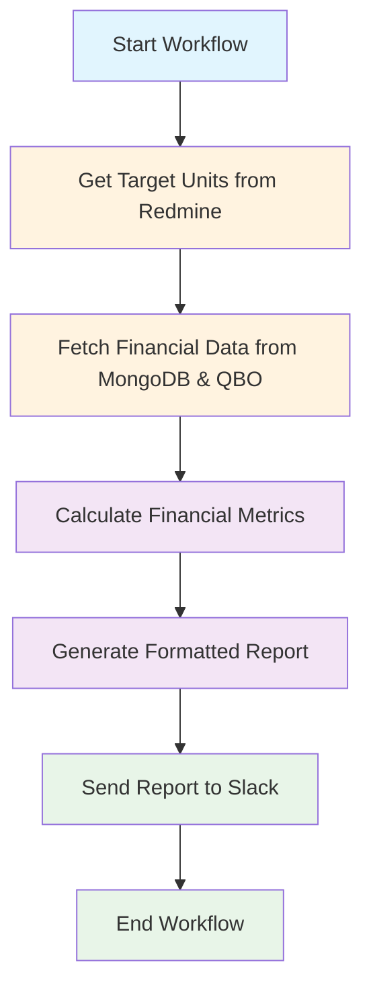

# System Overview

## What is the Weekly Financial Summary System?

The Weekly Financial Summary system is an automated workflow that generates comprehensive financial reports for Target Units (TUs) - specific project groups within your organization. The system processes data from multiple sources to provide actionable insights about project profitability and performance.

## 🎯 System Purpose

### For Project Managers

The system helps you:

- **Monitor project profitability** in real-time
- **Identify performance trends** across different Target Units
- **Make data-driven decisions** about resource allocation
- **Track financial health** of ongoing projects

### For Financial Analysts

The system provides:

- **Automated financial calculations** with consistent methodology
- **Integration with multiple data sources** (Redmine, QuickBooks, MongoDB)
- **Standardized reporting format** for easy analysis
- **Historical data tracking** for trend analysis

## 🔄 How the System Works

The Weekly Financial Summary workflow follows a structured process:

### Step-by-Step Process

1. **Data Extraction**: The system retrieves Target Unit data from Redmine, including:

   - Project information and assignments
   - Time tracking data (hours worked)
   - User assignments and project relationships

2. **Financial Data Integration**: The system fetches additional data from:

   - **MongoDB**: Employee rates, project rates, and historical data
   - **QuickBooks Online**: Actual revenue data for effective calculations

3. **Calculation Engine**: The system performs complex financial calculations:

   - Revenue calculations based on project rates
   - Cost calculations based on employee rates
   - Margin and marginality calculations
   - Effective revenue and margin calculations

4. **Report Generation**: The system creates formatted reports with:

   - Color-coded performance indicators
   - Detailed financial breakdowns
   - Summary statistics and trends

5. **Delivery**: Reports are automatically sent to Slack channels for easy access and collaboration.

## 📊 Key Components

### Target Units (TUs)

Target Units are specific project groups that represent:

- **Client projects** with defined scopes and deliverables
- **Internal initiatives** with measurable outcomes
- **Resource allocations** with time and cost tracking

### Financial Metrics

The system calculates several key financial indicators:

| Metric                    | Description                                   | Business Impact                 |
| ------------------------- | --------------------------------------------- | ------------------------------- |
| **Revenue**               | Project rate × hours worked                   | Shows project income potential  |
| **COGS**                  | Employee rate × hours worked                  | Represents actual project costs |
| **Margin**                | Revenue - COGS                                | Direct project profitability    |
| **Marginality**           | (Margin ÷ Revenue) × 100%                     | Profitability percentage        |
| **Effective Revenue**     | Actual QBO revenue                            | Real-world income               |
| **Effective Margin**      | Effective Revenue - COGS                      | Actual profitability            |
| **Effective Marginality** | (Effective Margin ÷ Effective Revenue) × 100% | Real profitability percentage   |

### Performance Categories

Target Units are categorized by their marginality performance:

- 🟢 **High Performance** (55%+ marginality): Excellent profitability, maintain current approach
- 🟡 **Medium Performance** (45-55% marginality): Good profitability, consider optimization opportunities
- 🔴 **Low Performance** (<45% marginality): Needs immediate attention and improvement strategies

## 🎨 Report Structure

### Summary Report

The main report provides a high-level overview:

- **Performance categorization** with color-coded indicators
- **Quick identification** of high and low performers
- **Overall system health** at a glance

### Detailed Report

The detailed report (in Slack thread) includes:

- **Individual Target Unit breakdowns** with specific metrics
- **Historical comparisons** and trend analysis
- **Actionable insights** for improvement

## 🔧 System Architecture

### Data Sources

- **Redmine**: Project management and time tracking
- **MongoDB**: Employee and project rate history
- **QuickBooks Online**: Actual revenue and financial data
- **Slack**: Report delivery and collaboration

### Technology Stack

- **Temporal Workflow Engine**: Orchestrates the entire process
- **Node.js/TypeScript**: Core application logic
- **Database Connections**: PostgreSQL (Redmine), MongoDB, QBO API
- **Slack API**: Report delivery and formatting

## 🎯 Business Value

### Immediate Benefits

- **Automated reporting** eliminates manual data collection
- **Consistent methodology** ensures reliable comparisons
- **Real-time insights** enable quick decision-making
- **Standardized format** improves communication

### Long-term Impact

- **Performance optimization** through data-driven insights
- **Resource allocation** based on profitability analysis
- **Trend identification** for strategic planning
- **Cost management** through detailed cost tracking

## 🚀 Getting Started

### For New Users

1. **Review this overview** to understand the system purpose
2. **Check the [Report Examples](04-report-examples.md)** to see actual outputs
3. **Read the [Interpretation Guide](08-interpretation-guide.md)** for business insights

### For Technical Users

1. **Study the [Technical Architecture](07-technical-architecture.md)** for system details
2. **Review [Data Sources](03-data-sources.md)** for integration information
3. **Check [Financial Metrics](02-financial-metrics.md)** for calculation details

## 📈 Success Metrics

The system's success is measured by:

- **Report accuracy** and consistency
- **User adoption** and engagement
- **Decision-making improvement** based on insights
- **Process efficiency** gains from automation

---

**Next Steps**:

- [Financial Metrics](02-financial-metrics.md) - Detailed calculations and formulas
- [Report Examples](04-report-examples.md) - Real reports with explanations
- [Data Sources](03-data-sources.md) - Integration details and data flow
