# Financial Metrics and Formulas

This section provides detailed explanations of all financial calculations performed by the Weekly Financial Summary system. These metrics are essential for understanding project profitability and making informed business decisions.

## 📊 Core Financial Concepts

### Revenue vs. Effective Revenue

**Revenue** is calculated based on project rates and represents the expected income from a project.

**Effective Revenue** comes from QuickBooks Online and represents the actual revenue received or invoiced.

This distinction is crucial because:

- **Revenue** shows planned/expected income
- **Effective Revenue** shows actual business performance
- The difference can indicate billing issues, scope changes, or pricing adjustments

### COGS (Cost of Goods Sold)

COGS represents the direct costs associated with delivering a project, primarily employee costs based on their rates and hours worked.

## 🧮 Detailed Calculations

### 1. Revenue Calculation

**Formula:**

```
Revenue = Project Rate × Total Hours
```

**Example:**

- Project Rate: $80/hour
- Total Hours: 100 hours
- Revenue = $80 × 100 = $8,000

**Implementation Details:**

- Project rates are retrieved from MongoDB with historical tracking
- Rates are determined by the date of work (`spent_on` field)
- If no project rate is available, the calculation defaults to 0

### 2. COGS (Cost of Goods Sold) Calculation

**Formula:**

```
COGS = Employee Rate × Total Hours
```

**Example:**

- Employee Rate: $50/hour
- Total Hours: 100 hours
- COGS = $50 × 100 = $5,000

**Implementation Details:**

- Employee rates are retrieved from MongoDB with historical tracking
- Rates are determined by the date of work (`spent_on` field)
- If no employee rate is available, the calculation defaults to 0

### 3. Margin Calculation

**Formula:**

```
Margin = Revenue - COGS
```

**Example:**

- Revenue: $8,000
- COGS: $5,000
- Margin = $8,000 - $5,000 = $3,000

### 4. Marginality Calculation

**Formula:**

```
Marginality = (Margin ÷ Revenue) × 100%
```

**Example:**

- Margin: $3,000
- Revenue: $8,000
- Marginality = ($3,000 ÷ $8,000) × 100% = 37.5%

**Important Notes:**

- If Revenue is 0, Marginality is set to 0% to avoid division by zero
- Marginality is expressed as a percentage
- Higher marginality indicates better profitability

### 5. Effective Revenue Integration

**Source:** QuickBooks Online API

**Process:**

1. System retrieves actual revenue data from QBO
2. Data is matched to projects using QuickBooks customer references
3. Revenue is aggregated by project for the reporting period

**Example:**

- QBO shows $10,000 actual revenue for Project A
- System uses this as Effective Revenue instead of calculated Revenue

### 6. Effective Margin Calculation

**Formula:**

```
Effective Margin = Effective Revenue - COGS
```

**Example:**

- Effective Revenue: $10,000
- COGS: $5,000
- Effective Margin = $10,000 - $5,000 = $5,000

### 7. Effective Marginality Calculation

**Formula:**

```
Effective Marginality = (Effective Margin ÷ Effective Revenue) × 100%
```

**Example:**

- Effective Margin: $5,000
- Effective Revenue: $10,000
- Effective Marginality = ($5,000 ÷ $10,000) × 100% = 50%

## 🎯 Performance Classification

### Standard Marginality Thresholds

The system classifies Target Units based on their marginality performance:

```mermaid
graph LR
    A[Marginality < 45%] --> B[🔴 Low Performance]
    C[Marginality 45-55%] --> D[🟡 Medium Performance]
    E[Marginality ≥ 55%] --> F[🟢 High Performance]

    style B fill:#ffebee
    style D fill:#fff8e1
    style F fill:#e8f5e8
```



### Effective Marginality Thresholds

For effective marginality, the system uses more granular classification:

```mermaid
graph LR
    A[Effective Marginality < 30%] --> B[🔴 Very Low]
    C[Effective Marginality 30-45%] --> D[🟡 Low]
    E[Effective Marginality 45-55%] --> F[🟠 Medium]
    G[Effective Marginality ≥ 55%] --> H[🟢 High]

    style B fill:#ffebee
    style D fill:#fff3e0
    style F fill:#fff8e1
    style H fill:#e8f5e8
```



## 📈 Calculation Flow Diagram

```mermaid
graph TD
    A[Target Unit Data] --> B[Get Employee Rate]
    A --> C[Get Project Rate]
    A --> D[Get Effective Revenue from QBO]

    B --> E[COGS = Employee Rate × Hours]
    C --> F[Revenue = Project Rate × Hours]
    D --> G[Effective Revenue from QBO]

    E --> H[Margin = Revenue - COGS]
    F --> H
    G --> I[Effective Margin = Effective Revenue - COGS]
    E --> I

    H --> J[Marginality = Margin ÷ Revenue × 100%]
    I --> K[Effective Marginality = Effective Margin ÷ Effective Revenue × 100%]

    J --> L[Classify Performance Level]
    K --> M[Classify Effective Performance Level]

    style A fill:#e1f5fe
    style E fill:#fff3e0
    style F fill:#fff3e0
    style G fill:#fff3e0
    style H fill:#f3e5f5
    style I fill:#f3e5f5
    style J fill:#e8f5e8
    style K fill:#e8f5e8
```



## 🔍 Real-World Example

Let's walk through a complete calculation using real data:

### Input Data

- **Target Unit**: Altavia TU
- **Period**: Q3
- **Total Hours**: 111.8 hours
- **Employee Rate**: $20.82/hour (calculated from COGS)
- **Project Rate**: $80.00/hour
- **Effective Revenue**: $14,073 (from QBO)

### Step-by-Step Calculation

1. **Revenue Calculation**

   ```
   Revenue = $80.00 × 111.8 = $8,944
   ```

2. **COGS Calculation**

   ```
   COGS = $20.82 × 111.8 = $2,327
   ```

3. **Margin Calculation**

   ```
   Margin = $8,944 - $2,327 = $6,617
   ```

4. **Marginality Calculation**

   ```
   Marginality = ($6,617 ÷ $8,944) × 100% = 74%
   ```

5. **Effective Margin Calculation**

   ```
   Effective Margin = $14,073 - $2,327 = $11,746
   ```

6. **Effective Marginality Calculation**
   ```
   Effective Marginality = ($11,746 ÷ $14,073) × 100% = 83%
   ```

### Performance Classification

- **Standard Marginality**: 74% → 🟢 High Performance (≥55%)
- **Effective Marginality**: 83% → 🟢 High Performance (≥55%)

## ⚠️ Important Considerations

### Data Quality

- **Rate History**: The system uses historical rate data, so rate changes are tracked over time
- **Date Matching**: All calculations use the `spent_on` date to ensure accurate rate application
- **Missing Data**: If rates are unavailable, calculations default to 0 to prevent errors

### Calculation Accuracy

- **Rounding**: All calculations maintain precision until final display
- **Division by Zero**: Protected against division by zero in marginality calculations
- **Data Validation**: Input data is validated before calculations begin

### Business Context

- **Effective Revenue**: May differ from calculated revenue due to:
  - Billing adjustments
  - Scope changes
  - Pricing modifications
  - Payment timing differences

## 🎯 Using These Metrics

### For Project Managers

- **Monitor marginality trends** to identify performance issues early
- **Compare standard vs. effective metrics** to understand billing accuracy
- **Use performance categories** to prioritize attention and resources

### For Financial Analysts

- **Validate calculations** against source data
- **Analyze rate trends** over time
- **Identify discrepancies** between planned and actual revenue
- **Audit data quality** and completeness

---

**Next Steps**:

- [Data Sources](03-data-sources.md) - Understanding where data comes from
- [Report Examples](04-report-examples.md) - Seeing these calculations in action
- [Technical Architecture](07-technical-architecture.md) - Implementation details
