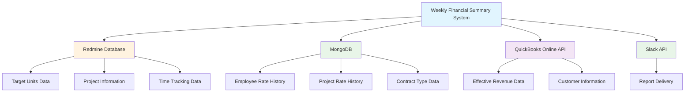
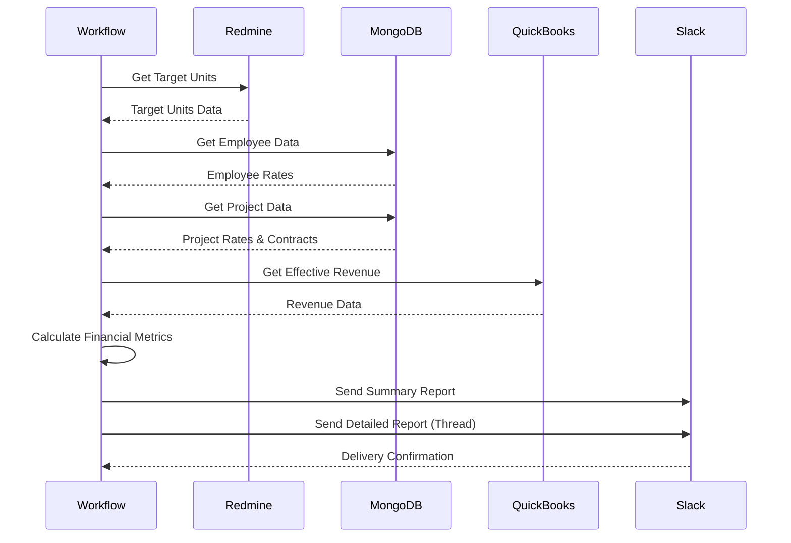

# Data Sources

This section explains where the Weekly Financial Summary system gets its data and how different systems are integrated to provide comprehensive financial reporting.

## 🔗 System Integration Overview

The Weekly Financial Summary system integrates data from three primary sources:



## 📊 Redmine Database

### Purpose

Redmine serves as the primary source for project management data, including Target Units, time tracking, and project assignments.

### Data Retrieved

#### Target Units Data

```sql
-- Simplified representation of Target Units query
SELECT
    group_id,
    group_name,
    project_id,
    project_name,
    user_id,
    username,
    spent_on,
    total_hours
FROM target_units_view
WHERE spent_on BETWEEN start_date AND end_date
```

**Key Fields:**

- `group_id`: Unique identifier for the Target Unit group
- `group_name`: Human-readable name of the Target Unit
- `project_id`: Redmine project identifier
- `project_name`: Project name from Redmine
- `user_id`: Employee identifier in Redmine
- `username`: Employee username
- `spent_on`: Date when work was performed
- `total_hours`: Hours worked on the project

#### Project Information

- Project details and metadata
- Project assignments and relationships
- Project status and configuration

#### Time Tracking Data

- Detailed time entries
- Work breakdown by project and user
- Time period aggregation

### Data Flow

1. **Connection**: System connects to Redmine PostgreSQL database
2. **Query Execution**: Target Units data is retrieved for the reporting period
3. **Data Processing**: Raw data is processed and validated
4. **File Storage**: Processed data is saved as JSON for further processing

## 🗄️ MongoDB

### Purpose

MongoDB stores employee and project rate history, contract type information, and other financial metadata.

### Data Retrieved

#### Employee Rate History

```javascript
// Employee rate structure
{
  redmine_id: 123,
  history: {
    rate: [
      {
        start_date: "2024-01-01",
        end_date: "2024-06-30",
        rate: 50.00
      },
      {
        start_date: "2024-07-01",
        end_date: null,
        rate: 55.00
      }
    ]
  }
}
```

#### Project Rate History

```javascript
// Project rate structure
{
  redmine_id: 456,
  history: {
    rate: [
      {
        start_date: "2024-01-01",
        end_date: "2024-03-31",
        rate: 75.00
      },
      {
        start_date: "2024-04-01",
        end_date: null,
        rate: 80.00
      }
    ]
  }
}
```

#### Contract Type Data

```javascript
// Contract type structure
{
  redmine_id: 456,
  history: {
    contractType: [
      {
        start_date: "2024-01-01",
        end_date: "2024-06-30",
        contractType: "Fixed Price"
      },
      {
        start_date: "2024-07-01",
        end_date: null,
        contractType: "Time & Materials"
      }
    ]
  }
}
```

### Data Processing

1. **Connection**: System connects to MongoDB instance
2. **Employee Data**: Retrieves employee rate history by Redmine IDs
3. **Project Data**: Retrieves project rate and contract type history
4. **Rate Resolution**: Determines appropriate rates based on work dates
5. **Data Aggregation**: Combines employee and project data

## 💰 QuickBooks Online (QBO)

### Purpose

QuickBooks Online provides actual revenue data for effective financial calculations, representing real-world business performance.

### Data Retrieved

#### Effective Revenue Data

```javascript
// QBO revenue structure
{
  customerRef: "12345",
  totalAmount: 14073.00,
  period: "Q3-2024"
}
```

### Integration Process

1. **API Connection**: System authenticates with QBO API using OAuth2
2. **Customer Matching**: Projects are matched to QBO customers using customer references
3. **Revenue Retrieval**: Actual revenue data is fetched for the reporting period
4. **Data Aggregation**: Revenue is aggregated by project/customer

### Data Mapping

- **Redmine Project** → **QBO Customer** (via customer reference)
- **Reporting Period** → **QBO Invoice Period**
- **Project Revenue** → **Customer Total Revenue**

## 📱 Slack Integration

### Purpose

Slack serves as the delivery mechanism for generated reports, providing easy access and collaboration.

### Report Delivery Process

1. **Report Generation**: System creates formatted report content
2. **Slack API Call**: Report is sent to designated Slack channel
3. **Thread Creation**: Detailed report is posted as a reply in the thread
4. **Notification**: Team members receive notifications about new reports

### Report Structure

- **Main Message**: Summary with performance categories
- **Thread Reply**: Detailed breakdown with specific metrics
- **Formatting**: Color-coded indicators and structured layout

## 🔄 Data Flow Architecture



## 📋 Data Quality and Validation

### Data Validation Rules

1. **Required Fields**: All essential fields must be present
2. **Date Validation**: Work dates must be within valid ranges
3. **Rate Validation**: Rates must be positive numbers
4. **Reference Validation**: External references must be valid

### Error Handling

- **Missing Data**: Default values are used when data is unavailable
- **Connection Failures**: System retries with exponential backoff
- **Data Inconsistencies**: Logged for investigation and correction

### Data Freshness

- **Real-time**: Redmine and MongoDB data is current
- **Near Real-time**: QBO data may have slight delays
- **Caching**: Frequently accessed data is cached for performance

## 🔧 Technical Implementation

### Database Connections

```typescript
// Redmine connection
const redminePool = new RedminePool(redmineDatabaseConfig);

// MongoDB connection
const mongoPool = MongoPool.getInstance();

// QBO connection
const qboRepo = new QBORepository();
```

### Data Processing Pipeline

1. **Extract**: Data is retrieved from all sources
2. **Transform**: Data is processed and normalized
3. **Load**: Processed data is stored for calculations
4. **Calculate**: Financial metrics are computed
5. **Format**: Results are formatted for reporting

## 🎯 Data Usage by Component

### Target Units Processing

- **Source**: Redmine database
- **Usage**: Primary data for all calculations
- **Frequency**: Retrieved for each reporting period

### Rate Resolution

- **Source**: MongoDB
- **Usage**: Determines employee and project rates
- **Frequency**: Retrieved for each Target Unit

### Effective Revenue

- **Source**: QuickBooks Online
- **Usage**: Provides actual revenue for comparison
- **Frequency**: Retrieved for each reporting period

### Report Delivery

- **Source**: Generated data
- **Usage**: Formatted reports sent to Slack
- **Frequency**: After each calculation cycle

## ⚠️ Important Considerations

### Data Dependencies

- **Redmine**: Must be available for basic functionality
- **MongoDB**: Required for rate calculations
- **QBO**: Enhances accuracy but not critical for basic reports
- **Slack**: Required for report delivery

### Performance Considerations

- **Parallel Processing**: Multiple data sources are queried simultaneously
- **Caching**: Rate data is cached to improve performance
- **Connection Pooling**: Database connections are pooled for efficiency

### Security and Compliance

- **Authentication**: All external APIs use secure authentication
- **Data Privacy**: Sensitive financial data is handled securely
- **Audit Trail**: All data access is logged for compliance

---

**Next Steps**:

- [Report Examples](04-report-examples.md) - See how this data becomes reports
- [Technical Architecture](07-technical-architecture.md) - Implementation details
- [Financial Metrics](02-financial-metrics.md) - How data is used in calculations
