# Report Examples

This section provides real examples of Weekly Financial Summary reports with detailed explanations of what each section means and how to interpret the results.

## 📊 Report Structure Overview

The Weekly Financial Summary reports consist of two main parts:

1. **Summary Report** - High-level overview with performance categories
2. **Detailed Report** - Specific metrics for each Target Unit (in Slack thread)

## 🎯 Summary Report Example

### Report Header

```
Weekly Financial Summary for Target Units
Period: 2025-07-01 - 2025-08-31
Sent by: Reporter APP
```

### Performance Categories

The summary report categorizes Target Units by their marginality performance:

#### 🟢 High Performance (55%+ marginality)

**16 Target Units** with excellent profitability:

- Altavia TU
- Apostrophe TU
- Cultivating Leadership TU
- Eigen X: AAAS Support TU
- ElectricKite: PAW Support TU
- ElectricKite: Support Projects TU
- Opensupplyhub TU
- Restorecore TU
- Revel Communities TU
- Rob Scanlon TU
- Spark: St. Norbert TU
- Spark: Sun Auto TU
- Spark: Xylem TU
- Stagen TU
- The Athletic TU
- Two Labs TU

#### 🟡 Medium Performance (45-55% marginality)

**3 Target Units** with good profitability, room for improvement:

- Sealworks TU
- Spark: Organogenesis TU
- TDE: Developmental Sprint App TU

#### 🔴 Low Performance (<45% marginality)

**3 Target Units** needing attention:

- Bish Creative TU
- Turnberry TU
- Wells Tech TU

### Summary Footer

```
The specific figures will be available in the thread.
2 replies • Last reply 1 day ago
```

## 📋 Detailed Report Example

The detailed report provides specific financial metrics for each Target Unit. Here are examples from the high-performance category:

### Example 1: Altavia TU

```
Altavia TU:
• period: Q3
• contract type: n/a
• total hours: 111.8
• revenue: $8,940
• COGS: $2,327
• margin: $6,613
• marginality: 74%
• effective revenue: $14,073
• effective margin: $11,746
• effective marginality: 83% 🟢
```

**Interpretation:**

- **Excellent Performance**: 74% marginality indicates very high profitability
- **Strong Effective Performance**: 83% effective marginality shows even better real-world performance
- **Revenue vs. Effective Revenue**: $8,940 calculated vs. $14,073 actual shows significant billing improvement
- **Cost Efficiency**: Low COGS ($2,327) relative to revenue indicates efficient resource utilization

### Example 2: Apostrophe TU

```
Apostrophe TU:
• period: Q3
• contract type: n/a
• total hours: 105.5
• revenue: $5,132
• COGS: $2,195
• margin: $2,937
• marginality: 57%
• effective revenue: $10,179
• effective margin: $7,984
• effective marginality: 78% 🟢
```

**Interpretation:**

- **Good Performance**: 57% marginality is above the high-performance threshold
- **Excellent Effective Performance**: 78% effective marginality indicates strong real-world results
- **Revenue Improvement**: Effective revenue ($10,179) is nearly double calculated revenue ($5,132)
- **Consistent Performance**: Both standard and effective metrics show strong profitability

### Example 3: Cultivating Leadership TU

```
Cultivating Leadership TU:
• period: Q3
• contract type: n/a
• total hours: 62.8
• revenue: $9,413
• COGS: $1,947
• margin: $7,466
• marginality: 79%
• effective revenue: $2,500
• effective margin: $553
• effective marginality: 22% 🔴
```

**Interpretation:**

- **Mixed Performance**: 79% calculated marginality vs. 22% effective marginality
- **Billing Discrepancy**: Large difference between calculated ($9,413) and effective ($2,500) revenue
- **Investigation Needed**: This Target Unit requires immediate attention to understand the revenue difference
- **Potential Issues**: Could indicate billing problems, scope changes, or data quality issues

## 🔍 Understanding the Metrics

### Revenue vs. Effective Revenue

The difference between calculated revenue and effective revenue can indicate:

**Positive Differences (Effective > Calculated):**

- ✅ Billing improvements or rate increases
- ✅ Additional scope or change orders
- ✅ Better than expected project performance

**Negative Differences (Effective < Calculated):**

- ⚠️ Billing delays or issues
- ⚠️ Scope reductions or cancellations
- ⚠️ Rate adjustments or discounts
- ⚠️ Data quality issues

### Marginality Analysis

Marginality percentages help categorize performance:

```mermaid
graph LR
    A[< 45%] --> B[🔴 Needs Attention]
    C[45-55%] --> D[🟡 Room for Improvement]
    E[≥ 55%] --> F[🟢 Excellent Performance]

    style B fill:#ffebee
    style D fill:#fff8e1
    style F fill:#e8f5e8
```



### Effective Marginality Indicators

The system uses color-coded indicators for effective marginality:

- 🟢 **Green Circle**: High performance (≥55%)
- 🟡 **Yellow Circle**: Medium performance (45-55%)
- 🔴 **Red Circle**: Low performance (30-45%)
- 🚫 **No Entry**: Very low performance (<30%)

## 📈 Performance Trends

### High Performers Analysis

**Common Characteristics:**

- High marginality (55%+)
- Strong effective revenue
- Efficient cost management
- Consistent performance

**Action Items:**

- Maintain current approach
- Document best practices
- Consider scaling successful models

### Medium Performers Analysis

**Common Characteristics:**

- Marginality between 45-55%
- Room for improvement
- Potential optimization opportunities

**Action Items:**

- Analyze cost structure
- Review pricing strategy
- Identify efficiency improvements

### Low Performers Analysis

**Common Characteristics:**

- Marginality below 45%
- Cost or revenue issues
- Need immediate attention

**Action Items:**

- Investigate root causes
- Implement improvement plans
- Monitor closely for progress

## 🎯 Business Insights

### Revenue Optimization

- **Effective Revenue Analysis**: Compare calculated vs. actual revenue to identify billing opportunities
- **Rate Optimization**: Analyze rate structures for underperforming projects
- **Scope Management**: Review scope changes that impact revenue

### Cost Management

- **Resource Efficiency**: Identify projects with high COGS relative to revenue
- **Rate Analysis**: Review employee rates for cost optimization opportunities
- **Time Management**: Analyze hours worked vs. expected hours

### Performance Improvement

- **Best Practices**: Document successful project approaches
- **Process Optimization**: Identify common factors in high-performing projects
- **Resource Allocation**: Use performance data for future project planning

## 📊 Report Usage Guidelines

### For Project Managers

1. **Review Performance Categories**: Focus on low performers first
2. **Analyze Trends**: Look for patterns in performance over time
3. **Identify Action Items**: Use data to drive improvement initiatives
4. **Communicate Results**: Share insights with team members

### For Financial Analysts

1. **Validate Calculations**: Verify metrics against source data
2. **Analyze Discrepancies**: Investigate differences between calculated and effective metrics
3. **Trend Analysis**: Track performance changes over time
4. **Forecasting**: Use historical data for future projections

### For Business Leaders

1. **Strategic Planning**: Use performance data for resource allocation
2. **Investment Decisions**: Identify high-performing areas for expansion
3. **Risk Management**: Monitor low performers for potential issues
4. **Performance Management**: Set targets based on historical performance

## 🔧 Troubleshooting Common Issues

### Revenue Discrepancies

**Problem**: Large differences between calculated and effective revenue
**Solutions**:

- Verify QBO data accuracy
- Check for billing delays
- Review scope changes
- Validate rate calculations

### Low Marginality

**Problem**: Target Units consistently showing low marginality
**Solutions**:

- Review cost structure
- Analyze pricing strategy
- Identify efficiency opportunities
- Consider resource reallocation

### Data Quality Issues

**Problem**: Inconsistent or missing data in reports
**Solutions**:

- Verify data source connections
- Check for missing rate information
- Validate time tracking data
- Review data processing logic

---

**Next Steps**:

- [Interpretation Guide](08-interpretation-guide.md) - How to use these insights for decision-making
- [FAQ & Troubleshooting](05-faq-troubleshooting.md) - Common questions and solutions
- [Financial Metrics](02-financial-metrics.md) - Understanding the calculations behind these examples
