# Results Interpretation Guide

This section provides practical guidance on how to read, understand, and use Weekly Financial Summary reports for business decision-making and performance improvement.

## 🎯 Understanding Report Structure

### Report Components

Each Weekly Financial Summary report contains two main sections:

1. **Summary Report** - High-level performance overview
2. **Detailed Report** - Specific metrics for each Target Unit

### Performance Indicators

The system uses color-coded indicators to quickly identify performance levels:

```mermaid
graph LR
    A[🟢 Green Circle] --> B[High Performance<br/>55%+ marginality]
    C[🟡 Yellow Circle] --> D[Medium Performance<br/>45-55% marginality]
    E[🔴 Red Circle] --> F[Low Performance<br/>30-45% marginality]
    G[🚫 No Entry] --> H[Very Low Performance<br/><30% marginality]

    style B fill:#e8f5e8
    style D fill:#fff8e1
    style F fill:#ffebee
    style H fill:#ffebee
```

## 📊 Reading the Summary Report

### Performance Categories

The summary report groups Target Units into three performance categories:

#### 🟢 High Performance (55%+ marginality)

**What it means:**

- Excellent profitability and efficiency
- Strong revenue generation relative to costs
- Well-managed projects with good margins

**Action items:**

- ✅ **Maintain current approach** - these projects are performing well
- ✅ **Document best practices** - identify what makes these projects successful
- ✅ **Consider scaling** - use successful models for other projects
- ✅ **Recognize team performance** - acknowledge successful project teams

#### 🟡 Medium Performance (45-55% marginality)

**What it means:**

- Good profitability with room for improvement
- Solid performance but not optimal
- Potential for optimization and efficiency gains

**Action items:**

- 🔍 **Analyze cost structure** - review where costs can be reduced
- 🔍 **Review pricing strategy** - consider rate adjustments
- 🔍 **Identify efficiency opportunities** - look for process improvements
- 🔍 **Monitor closely** - track for improvement or decline

#### 🔴 Low Performance (<45% marginality)

**What it means:**

- Poor profitability requiring immediate attention
- High costs relative to revenue
- Potential project management or execution issues

**Action items:**

- 🚨 **Investigate root causes** - identify specific performance issues
- 🚨 **Implement improvement plans** - develop specific action items
- 🚨 **Monitor closely** - track progress and make adjustments
- 🚨 **Consider project review** - evaluate project viability

## 📋 Interpreting Detailed Metrics

### Key Financial Metrics Explained

#### Revenue vs. Effective Revenue

**Revenue**: Calculated based on project rates and hours
**Effective Revenue**: Actual revenue from QuickBooks Online

**Interpretation:**

- **Effective > Revenue**: Positive billing performance, possible rate increases or scope additions
- **Effective < Revenue**: Potential billing issues, scope reductions, or rate adjustments
- **Large differences**: Investigate billing accuracy and project scope changes

#### COGS (Cost of Goods Sold)

**What it represents:**

- Direct employee costs for project delivery
- Calculated as employee rate × hours worked

**Interpretation:**

- **High COGS**: May indicate expensive resources or inefficient time usage
- **Low COGS**: Could suggest efficient resource utilization or lower-cost resources
- **COGS trends**: Monitor for cost escalation or efficiency improvements

#### Margin and Marginality

**Margin**: Revenue - COGS (absolute profit amount)
**Marginality**: (Margin ÷ Revenue) × 100% (profitability percentage)

**Interpretation:**

- **High marginality**: Excellent profitability, efficient cost management
- **Low marginality**: Poor profitability, need for cost reduction or rate increases
- **Negative margin**: Project is losing money, immediate action required

## 🎯 Business Decision Framework

### Project Portfolio Analysis

#### High Performers (🟢)

**Strategic Actions:**

1. **Scale Success**: Apply successful models to other projects
2. **Resource Allocation**: Consider expanding high-performing teams
3. **Client Relationship**: Strengthen relationships with profitable clients
4. **Pricing Strategy**: Use as benchmarks for new project pricing

#### Medium Performers (🟡)

**Optimization Actions:**

1. **Cost Analysis**: Identify specific cost reduction opportunities
2. **Process Improvement**: Implement efficiency measures
3. **Rate Review**: Consider pricing adjustments
4. **Resource Optimization**: Review team composition and allocation

#### Low Performers (🔴)

**Corrective Actions:**

1. **Root Cause Analysis**: Identify specific performance issues
2. **Action Planning**: Develop specific improvement initiatives
3. **Resource Reallocation**: Consider team changes or project restructuring
4. **Client Communication**: Address scope or expectation issues

### Trend Analysis

#### Performance Trends

**Improving Performance:**

- ✅ Continue current strategies
- ✅ Document successful changes
- ✅ Apply lessons to other projects

**Declining Performance:**

- ⚠️ Investigate causes immediately
- ⚠️ Implement corrective measures
- ⚠️ Monitor closely for recovery

**Stable Performance:**

- 🔍 Look for optimization opportunities
- 🔍 Consider strategic improvements
- 🔍 Maintain current approach if satisfactory

## 📈 Using Reports for Strategic Planning

### Resource Allocation

**Data-driven decisions:**

- Allocate more resources to high-performing projects
- Reduce resources on consistently low-performing projects
- Balance portfolio across performance categories

### Pricing Strategy

**Rate optimization:**

- Use high performers as pricing benchmarks
- Adjust rates for medium performers based on market conditions
- Review pricing for low performers to improve profitability

### Client Management

**Relationship optimization:**

- Strengthen relationships with profitable clients
- Address issues with underperforming client projects
- Use performance data for contract negotiations

### Process Improvement

**Efficiency gains:**

- Identify best practices from high performers
- Implement process improvements for medium performers
- Address systemic issues affecting low performers

## 🚨 Red Flags and Warning Signs

### Immediate Attention Required

**Critical indicators:**

- 🔴 **Negative margins**: Project is losing money
- 🔴 **Very low effective marginality**: Real-world performance is poor
- 🔴 **Large revenue discrepancies**: Significant billing or scope issues
- 🔴 **Consistent decline**: Performance trending downward

### Investigation Needed

**Concerning patterns:**

- ⚠️ **High COGS relative to revenue**: Cost management issues
- ⚠️ **Effective revenue significantly lower**: Billing or scope problems
- ⚠️ **Inconsistent performance**: Unreliable project execution
- ⚠️ **Rate discrepancies**: Pricing or resource allocation issues

## 📊 Performance Benchmarking

### Internal Benchmarks

**Compare against:**

- Historical performance of the same Target Unit
- Average performance across all Target Units
- Performance of similar project types
- Team or individual performance trends

### External Benchmarks

**Industry standards:**

- Typical marginality ranges for your industry
- Market rates for similar services
- Industry best practices for cost management
- Client expectations and market conditions

## 🎯 Action Planning Framework

### Immediate Actions (0-30 days)

1. **Address critical issues** in low-performing Target Units
2. **Investigate anomalies** in revenue or cost data
3. **Communicate findings** to relevant stakeholders
4. **Implement quick wins** for medium performers

### Short-term Actions (1-3 months)

1. **Develop improvement plans** for underperforming projects
2. **Optimize processes** based on high performer analysis
3. **Adjust resource allocation** based on performance data
4. **Review and update pricing** strategies

### Long-term Actions (3-12 months)

1. **Strategic portfolio optimization** based on performance trends
2. **Process standardization** using best practices from high performers
3. **Team development** and training based on performance gaps
4. **Client relationship management** optimization

## 📞 Communication Guidelines

### Reporting to Management

**Key messages:**

- Overall portfolio performance and trends
- Specific issues requiring attention
- Success stories and best practices
- Resource allocation recommendations

### Team Communication

**Focus areas:**

- Individual and team performance feedback
- Process improvement opportunities
- Recognition of high performers
- Support for improvement initiatives

### Client Communication

**When appropriate:**

- Performance transparency for client projects
- Scope or pricing discussions based on data
- Process improvement communications
- Value delivery demonstrations

## 🔍 Continuous Improvement

### Regular Review Process

1. **Weekly**: Review new reports and identify immediate actions
2. **Monthly**: Analyze trends and adjust strategies
3. **Quarterly**: Comprehensive portfolio review and strategic planning
4. **Annually**: Long-term performance analysis and goal setting

### Learning and Development

- **Document lessons learned** from performance analysis
- **Share best practices** across teams and projects
- **Train teams** on performance optimization
- **Update processes** based on performance insights

---

**Next Steps**:

- [Report Examples](04-report-examples.md) - See these concepts in practice
- [Financial Metrics](02-financial-metrics.md) - Understand the calculations behind the insights
- [FAQ & Troubleshooting](05-faq-troubleshooting.md) - Address common questions and issues
- [System Overview](01-overview.md) - Return to the big picture understanding
